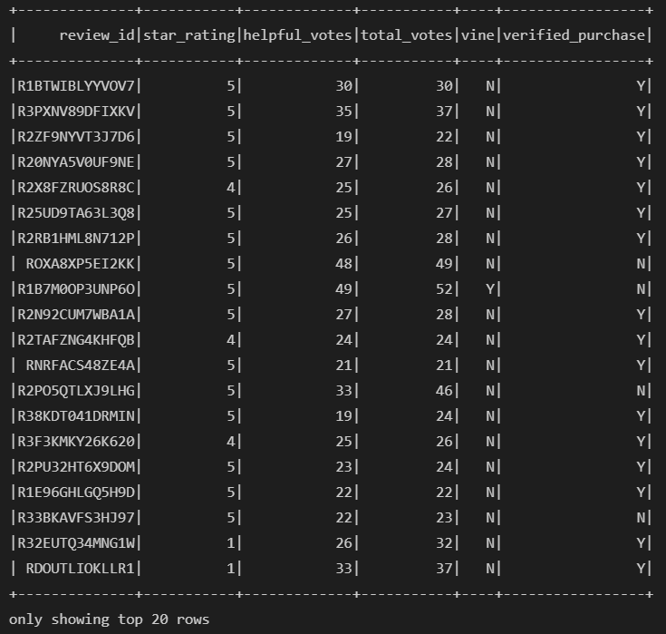
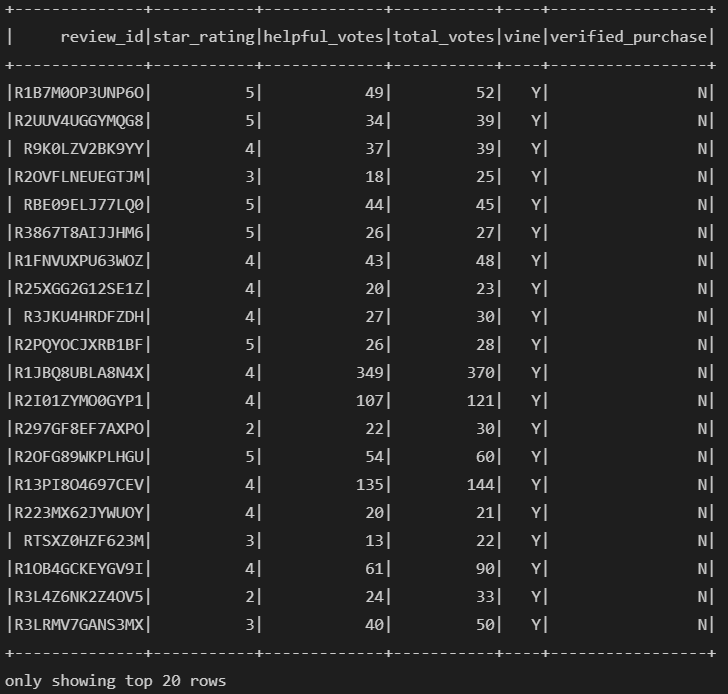
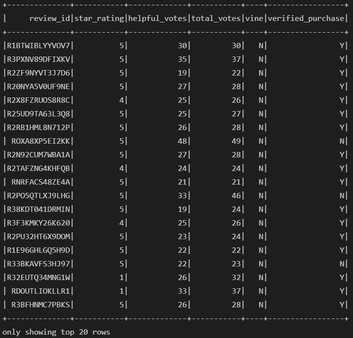

# Amazon Vine Analysis

## Overview of the Amazon Vine Analysis

BigMarket helps businesses optimize their marketing efforts. Their client needs help analyzing Amazon reviews written by members of the paid Amazon Vine program. The goal is to determine if there is any bias towards favorable reviews from Vine members in the sampled dataset. We will analyze the sample data set of Amazon reviews for Watches and figure out if having a paid Vine review makes a difference in the percentage of 5 star reviews.

## Resources

- Data Source: https://s3.amazonaws.com/amazon-reviews-pds/tsv/amazon_reviews_us_Watches_v1_00.tsv.gz
- Software: pgAdmin 5.7
- Web-based Software: AWS, S3, Google Colab, PySpark 3.0.3

## Results

The following table show the information of the dataset organized into a data-frame exclusively displaying the information we require for our analysis. The data-frame was then filtered to only include relevant data; in this case we are only examining the products which have over 20 reviews, and a ratio of helpful reviews over 50%.

The next two tables filter the previous data-frame even further by splitting the table into two data-frames. One data-frame containing only reviews from paid Vine members, and the other containing only reviews from non-Vine members.

With the data filtered to our specifications we can begin our analysis, and we are able to answer the following questions:

1) How many Vine reviews and non-Vine reviews were there?
- In this dataset there are 43 Vine reviews, and 7720 non-Vine reviews.

2) How many Vine reviews were 5 stars? How many non-Vine reviews were 5 stars?
- 14 of the Vine reviews were 5 stars, and 4018 of the non-Vine reviews were 5 stars.

3) What percentage of Vine reviews were 5 stars? What percentage of non-Vine reviews were 5 stars?
- This means approximately 32.56% of the Vine reviews were 5 stars, and approximately 52.05% of the non-Vine reviews were 5 stars.

## Summary

Given the results from this dataset, we cannot conclude that Amazon Vine reviewers have a bias toward 5 star reviews. On the contrary, the data would suggest a tendency for Amazon Vine reviewers to be more critical in their reviews than their non-Vine counter parts. This conclusion can be further examined by conducting the same analysis across a few different product categories to ensure the sampled dataset is not an outlier. Additionally, we can analyse the statistical distribution (mean, median, and mode) of the star ratings column for Vine vs non-Vine members for a more thorough analysis.

